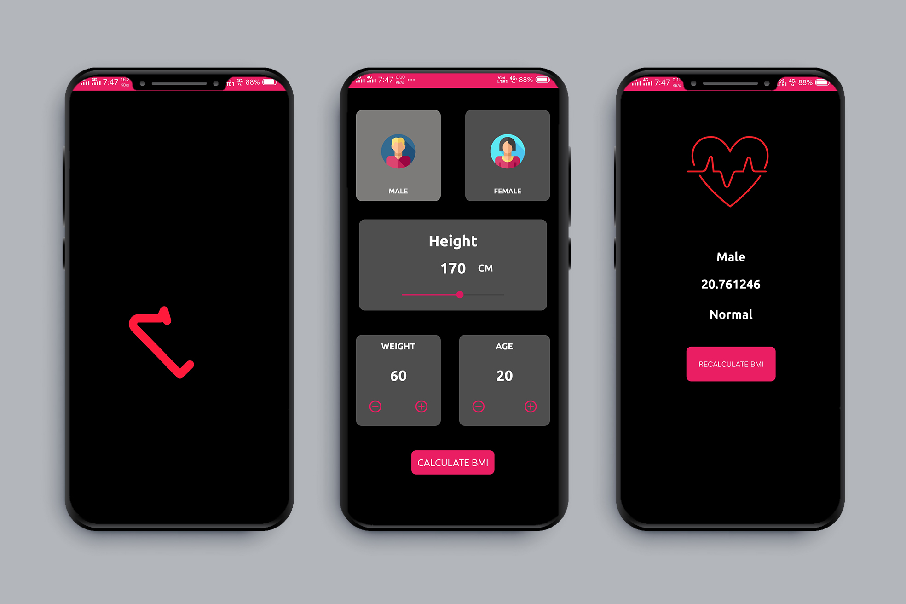

# BMI
<p align="center">

<h1 align="center">BMI - BODY MASS INDEX</h1>
</p>

<p align="center">
  <a href="https://opensource.org/licenses/Apache-2.0"></a>
  <a href="https://android-arsenal.com/api?level=21"></a>
  <a href="https://github.com/mayur-hajare"></a>
</p>

<p align="center">  
In today’s world, it is possible to just download a BMI Calculator App on your phone, and find out whether your body is in good shape or bad shape.</br>

<p align="center">

</p>	

 <p align="center">
<br><br><br>
</p>

# About the BMI Calculator App
BMI corresponds to “body mass index” which is a value derived from your height and your weight. 
With a BMI calculator app, you can find out whether you are anorexic, in good shape, overweight or obese. 
This is exactly what the BMI Calculator App was built for, just enter your height and weight and your BMI will be displayed in numbers and below your BMI you will be informed of the status of your body.

With the BMI Calculator App, it is now easier for you to set the ideal weight you want to reach with your diet. 
If you need help to prepare yourself a tailor-made diet with good ingredients, 
try our app “Calories and Nutrition” which gives you precise information on the nutritional value of various ingredients.


## Find this repository useful? :heart:
Support it by joining __[stargazers](https://github.com/mayur-hajare/BMI/stargazers)__ for this repository. :star: <br>
And __[follow me](https://github.com/mayur-hajare)__ me for my next creations! 🤩

# License
```xml
Designed and developed by 2021 mayur-hajare (Mayur Hajare)

Licensed under the Apache License, Version 2.0 (the "License");
you may not use this file except in compliance with the License.
You may obtain a copy of the License at

   http://www.apache.org/licenses/LICENSE-2.0

Unless required by applicable law or agreed to in writing, software
distributed under the License is distributed on an "AS IS" BASIS,
WITHOUT WARRANTIES OR CONDITIONS OF ANY KIND, either express or implied.
See the License for the specific language governing permissions and
limitations under the License.
```
